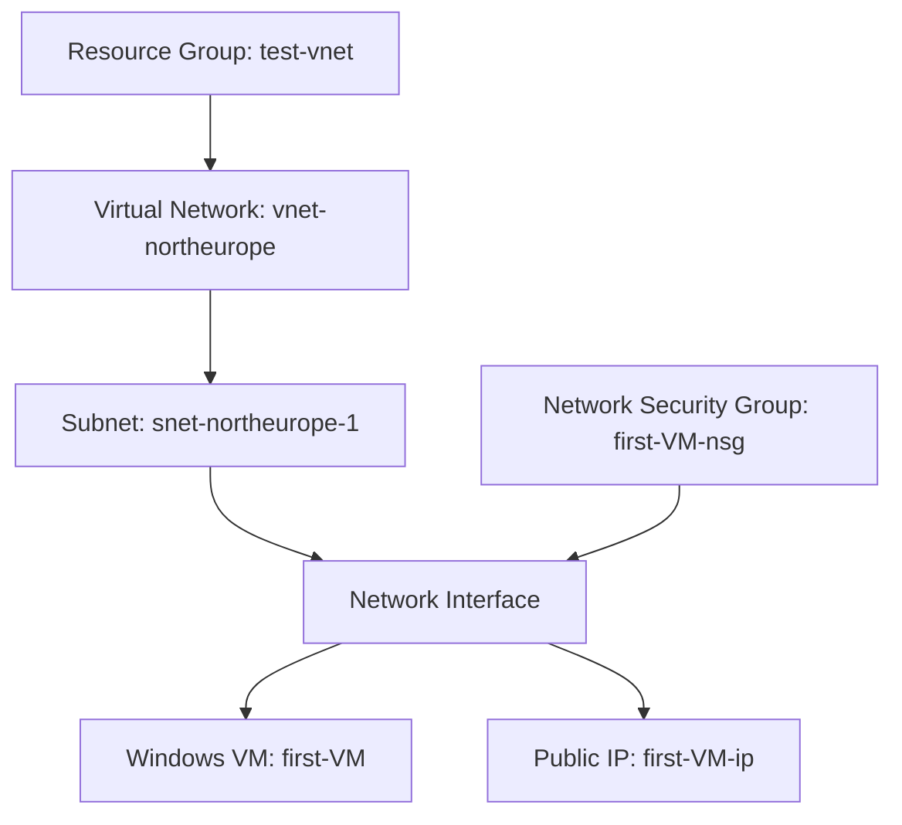

# Azure Windows VM Deployment – North Europe

## 📌 Overview

This lab demonstrates the deployment of a Windows Virtual Machine inside a dedicated Azure Virtual Network.

All resources are deployed in:

- **Resource Group:** test-vnet  
- **Region:** North Europe  

---

## 🏗 Deployed Resources

| Resource Type | Name |
|---------------|------|
| Virtual Network | vnet-northeurope |
| Subnet | snet-northeurope-1 |
| Network Security Group | first-VM-nsg |
| Public IP | first-VM-ip |
| Windows VM | first-VM |

## 🏗 Architecture Diagram

🔐 Security Notes
- VM is internet-facing via Public IP
- NSG controls inbound traffic
- RDP access should be restricted to trusted IPs
- Not production-ready (lab environment)

🧠 Architectural Observations
- Single-tier architecture
- No availability zone
- No load balancer
- No monitoring configured

🚀 Future Improvements
- Remove Public IP
- Implement Azure Bastion
- Add Availability Zone
- Enable Azure Monitor

  