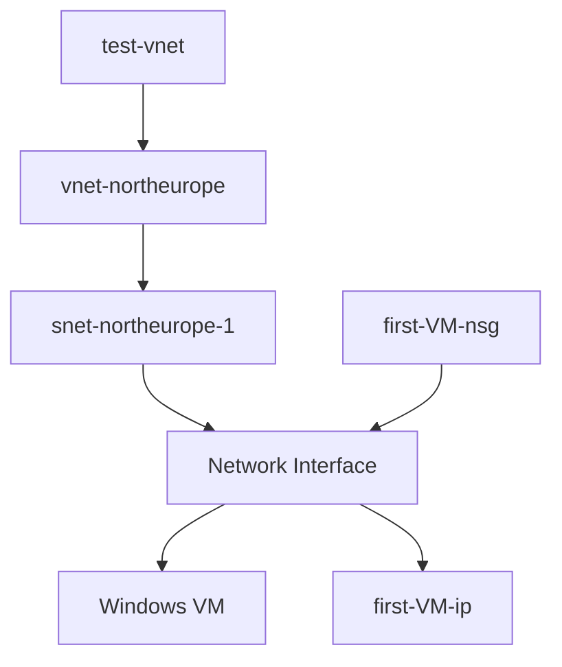

# Azure Windows VM Deployment – Architecture Case Study

## 🎯 Executive Summary

This project documents the deployment of a Windows Virtual Machine in Azure within a custom Virtual Network in North Europe.

The objective is not only to deploy infrastructure, but to analyze design decisions, security implications, risks, and potential production improvements.

---

## 📌 Overview

This lab demonstrates the deployment of a Windows Virtual Machine inside a dedicated Azure Virtual Network.

---

## 🏗 Deployment Context

- Resource Group: test-vnet  
- Region: North Europe  
- Virtual Network: vnet-northeurope  
- Subnet: snet-northeurope-1  
- Network Security Group: first-VM-nsg  
- Public IP: first-VM-ip  
- Virtual Machine: first-VM  

---

## 🏷 Architecture Classification

- Architecture Type: Single-tier  
- Availability Model: Single instance  
- Exposure Model: Internet-facing  
- Environment Type: Lab / Test  

---

## 🛡 Security Posture Assessment

Current Security Level: Basic (Lab)

- VM exposed via Public IP  
- RDP open (controlled by NSG)  
- No Just-in-Time (JIT) access enabled  
- No Azure Bastion  
- No centralized logging  

This architecture is suitable for testing purposes but not production environments.

---

## 🧠 Logical Architecture

---

### 🔗 Dependency Chain

Compute → Network Interface → Subnet → Virtual Network → Resource Group

---

## 🖼 Azure Portal Topology (Actual Deployment)

---

## 📌 Design Decisions

- Single-tier architecture selected for simplicity.
- NSG associated at NIC level for granular security control.
- Public IP enabled for direct RDP access (lab environment only).
- North Europe selected to ensure regional availability and EU data residency alignment.

---

## ⚖️ Trade-Off Analysis

| Decision | Benefit | Risk |
|----------|----------|------|
| Public IP on VM | Simple remote access | Increased attack surface & brute-force risk |
| Single VM | Low cost | No high availability |
| No Load Balancer | Simplicity | No scalability |

---

## ⚠️ Identified Risks

- Brute-force attacks on exposed RDP port  
- Single point of failure (single VM)  
- No centralized monitoring  
- No network segmentation beyond single subnet  

---

## 🚀 Production Improvement Roadmap

### Phase 1 – Security Hardening
- Remove Public IP  
- Implement Azure Bastion  
- Enable Just-in-Time access  
- Restrict inbound traffic to trusted sources  

### Phase 2 – Resilience
- Deploy VM in an Availability Zone  
- Implement backup strategy  
- Consider load balancing if scaling  

### Phase 3 – Observability
- Enable Azure Monitor  
- Enable Microsoft Defender for Cloud  
- Centralize logging and alerts  

---

## 💰 Cost Consideration

This architecture minimizes cost by using a single VM instance, but does not provide high availability or scalability.

---

## 📚 Learning Outcome

This lab reinforces:

- Azure networking fundamentals  
- NSG traffic evaluation logic  
- Compute dependency on network configuration  
- Security exposure analysis  
- Basic architectural trade-off evaluation  

---

## 🔍 Why This Matters

Even a simple VM deployment demonstrates the dependency chain in Azure:

- Compute depends on Networking  
- Networking depends on Security configuration  
- Security configuration impacts exposure and risk  

Understanding these relationships is fundamental for designing scalable and secure cloud architectures.