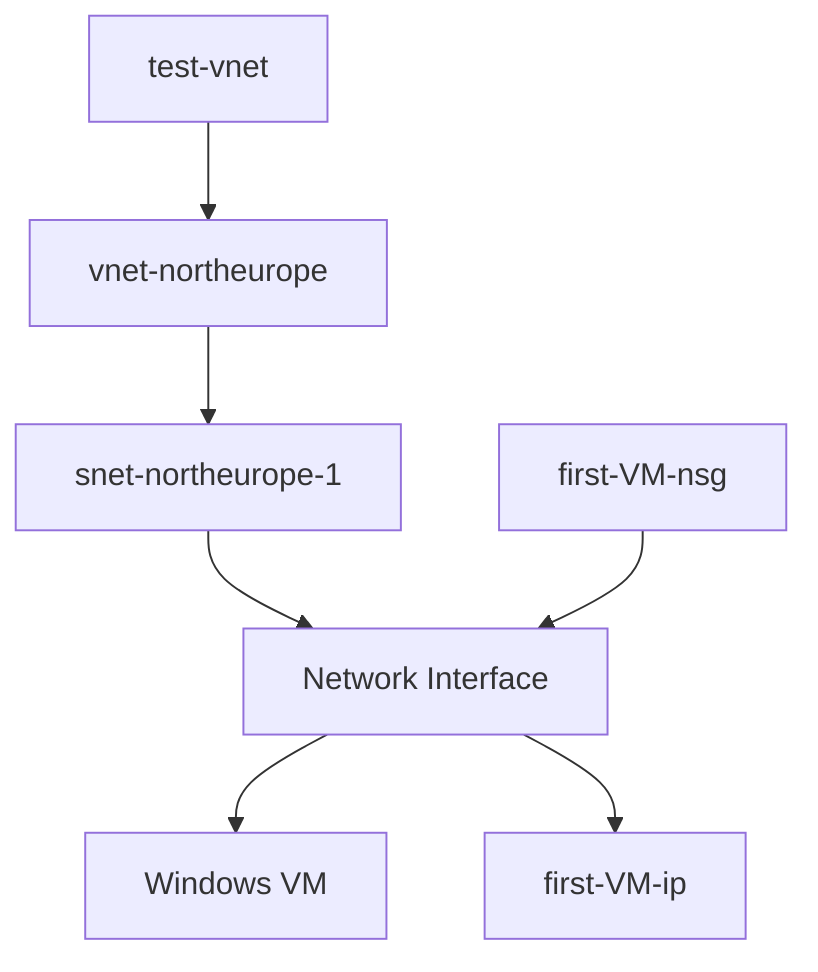

# Azure Windows VM Deployment – Architecture Case Study

## 🎯 Executive Summary
This project documents the deployment of a Windows Virtual Machine in Azure within a custom Virtual Network in North Europe.
The objective is not only to deploy infrastructure, but to analyze design decisions, security implications, and potential production improvements.

## 📌 Overview
This lab demonstrates the deployment of a Windows Virtual Machine inside a dedicated Azure Virtual Network.

## 🏷 Architecture Classification

- Architecture Type: Single-tier
- Availability Model: Single instance
- Exposure Model: Internet-facing
- Environment Type: Lab / Test
  

**Deployment Context**

- Resource Group: test-vnet
- Region: North Europe
- Virtual Network: vnet-northeurope
- Subnet: snet-northeurope-1
- Network Security Group: first-VM-nsg
- Public IP: first-VM-ip
- Virtual Machine: first-VM

---

## 🧠 Logical Architecture

---

### 🔗 Dependency Chain
Compute → Network Interface → Subnet → Virtual Network → Resource Group

## 🖼 Azure Portal Topology (Actual Deployment)

---

## 📌 Design Decisions
- Single-tier architecture for simplicity.
- NSG associated at NIC level.
- Public IP enabled for direct RDP access (lab environment).
- All resources deployed in North Europe.

---

## ⚖️ Trade-Off Analysis
| Decision | Benefit | Risk |
|----------|----------|------|
Public IP on VM | Simple remote access | Increased attack surface & brute-force risk
| Single VM | Low cost | No high availability |
| No Load Balancer | Simplicity | No scalability |

---

## 🚀 Production Evolution
- Remove Public IP
- Implement Azure Bastion
- Deploy VM in Availability Zone
- Enable Azure Monitor
- Enable Microsoft Defender for Cloud

---

## 📚 Learning Outcome
This lab reinforces:
- Azure networking fundamentals
- NSG traffic filtering
- VM dependency on networking
- Basic security posture analysis

## 🔍 Why This Matters
Even a simple VM deployment demonstrates the dependency chain in Azure:
Compute depends on Networking  
Networking depends on Security configuration  
Security impacts exposure and risk  
Understanding these relationships is fundamental for designing scalable and secure cloud architectures.
